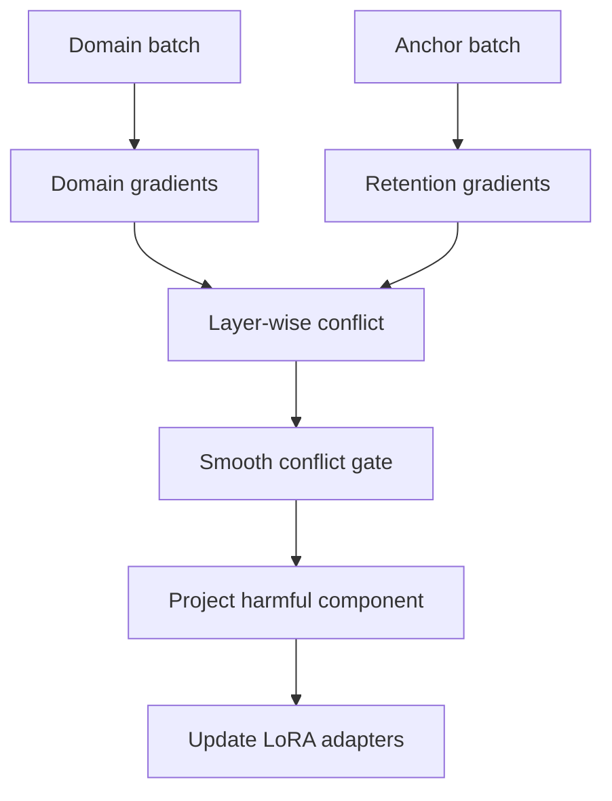
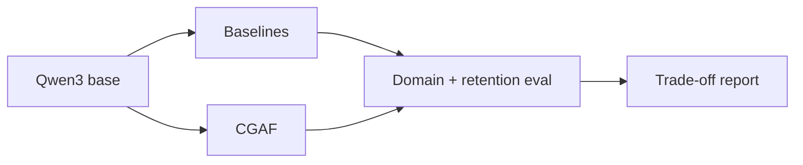

# CGAF-Tune

**Conflict-Gated Adaptive Fine-Tuning for capability-preserving LLM adaptation**

CGAF-Tune tests whether parameter-efficient fine-tuning can learn a narrow domain while preserving a base model's general capabilities. It targets **Qwen3-0.6B/1.7B on one 16–24 GB GPU** with LoRA or 4-bit QLoRA.

> **Research status:** early prototype. CGAF is a falsifiable hypothesis, not a claimed state-of-the-art result.

## Research question

Can layer-local gradient-conflict gates preserve general instruction following and reasoning better than ordinary LoRA, rehearsal, and ungated gradient projection at the same trainable-parameter and data budgets?

## Core idea

Each step computes adapter gradients from a domain batch and a small capability-retention anchor batch. For adapter group (l), CGAF measures cosine conflict and smoothly removes only the harmful component:

$$
g'_l = g^D_l - \gamma_l
\frac{\min(0,\langle g^D_l,g^A_l\rangle)}
{\lVert g^A_l\rVert^2+\epsilon}g^A_l,
\qquad
\gamma_l=\sigma(-c_l/T)
$$

Positive alignment is untouched. The hypothesis is that **soft, local intervention** yields a better adaptation–retention trade-off than globally mixing rehearsal loss or always projecting gradients.



## Comparison

| Method | Adaptive signal | Intervention | Retention target |
|---|---|---|---|
| LoRA | None | Low-rank update | No |
| AdaLoRA | Parameter importance | Rank allocation | No |
| Rehearsal LoRA | Mixed examples | Joint loss | Yes |
| PCGrad-style LoRA | Gradient conflict | Hard projection | Yes |
| **CGAF** | Per-group conflict | Smooth gated projection | Yes |



## Quick start

```bash
python -m venv .venv
source .venv/bin/activate
pip install -e ".[dev]"
python scripts/train.py --config configs/qwen3_0.6b.yaml --dry-run
pytest
```

A real run requires CUDA plus access to the configured Hugging Face model and datasets.

## Repository structure

- `src/cgaf_tune/` — conflict measurement and gated projection
- `scripts/train.py` — validated experiment entry point
- `configs/` — reproducible single-GPU configurations
- `tests/` — numerical unit tests
- `docs/research-proposal.md` — hypothesis, related work, and experimental design
- `docs/evaluation.md` — metrics, baselines, ablations, and reporting rules

## Planned baselines and ablations

- plain LoRA; rehearsal LoRA; hard PCGrad-style LoRA; AdaLoRA
- global versus layer-wise versus module-wise gates
- gate temperature, anchor size, projection frequency, and anchor-domain composition
- at least three seeds, equal data and update budgets

## Primary metrics

Domain score, retained capability score, forgetting, harmonic adaptation–retention score, peak GPU memory, wall-clock overhead, gate activity, and conflict by layer.

## References

1. Hu et al., [LoRA](https://arxiv.org/abs/2106.09685), 2021.
2. Zhang et al., [AdaLoRA](https://arxiv.org/abs/2303.10512), 2023.
3. Farajtabar et al., [Orthogonal Gradient Descent](https://arxiv.org/abs/1910.07104), 2019.
4. Wright et al., [SketchOGD](https://arxiv.org/abs/2305.16424), 2023.
5. Luo et al., [Catastrophic Forgetting in LLMs](https://arxiv.org/abs/2308.08747), 2023.
6. Yang et al., [Qwen3 Technical Report](https://arxiv.org/abs/2505.09388), 2025.
7. Meng et al., [PiSSA](https://arxiv.org/abs/2404.02948), 2024.

## License

Apache-2.0. Model and dataset licenses remain governed by their providers.
