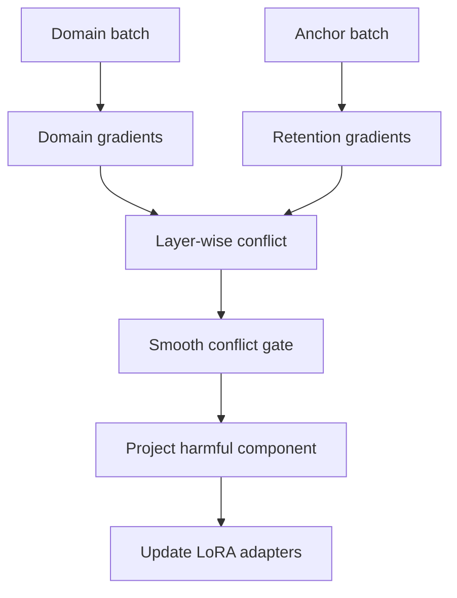
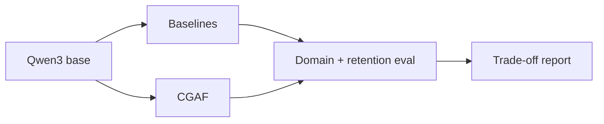

<div align="center">
  

  <h1>🌌 CGAF-Tune</h1>

  <p><strong>Conflict-Gated Adaptive Fine-Tuning for capability-preserving LLM adaptation</strong></p>

  <p>
    <a href="https://github.com/Anne07-Ai/cgaf-tune/actions/workflows/ci.yml"></a>
    
    
    
    
  </p>

  <p>
    <a href="#-research-question">Research</a> •
    <a href="#-how-cgaf-works">Method</a> •
    <a href="#-quick-start">Quick start</a> •
    <a href="#-evaluation">Evaluation</a> •
    <a href="docs/architecture.md">Architecture</a> •
    <a href="docs/research-proposal.md">Proposal</a>
  </p>
</div>

---

CGAF-Tune tests whether parameter-efficient fine-tuning can learn a narrow domain while preserving a base model's general capabilities. It targets **Qwen3-0.6B/1.7B on one 16–24 GB GPU** with LoRA or 4-bit QLoRA.

> [!IMPORTANT]
> **Research status:** early prototype. CGAF is a falsifiable hypothesis, not a claimed state-of-the-art result.\n>\n> **Phase 6 finding:** CGAF achieved the highest mean domain F1 but did not improve balanced harmonic F1 over LoRA or rehearsal across three seeds.

| 🔵 Learn | 🟣 Protect | ✨ Balance |
|---|---|---|
| Adapt to specialised domain data | Preserve general reasoning and instruction following | Intervene only when gradients conflict |

## 🎯 Research question

Can layer-local gradient-conflict gates preserve general instruction following and reasoning better than ordinary LoRA, rehearsal, and ungated gradient projection at the same trainable-parameter and data budgets?

## 🧠 How CGAF works

Each step computes adapter gradients from a domain batch and a small capability-retention anchor batch. For adapter group (l), CGAF measures cosine conflict and smoothly removes only the harmful component:

$$
g'_l = g^D_l - \gamma_l
\frac{\min(0,\langle g^D_l,g^A_l\rangle)}
{\lVert g^A_l\rVert^2+\epsilon}g^A_l,
\qquad
\gamma_l=\sigma(-c_l/T)
$$

Positive alignment is untouched. The hypothesis is that **soft, local intervention** yields a better adaptation–retention trade-off than globally mixing rehearsal loss or always projecting gradients.



## ⚔️ Method comparison

| Method | Adaptive signal | Intervention | Retention target |
|---|---|---|---|
| LoRA | None | Low-rank update | No |
| AdaLoRA | Parameter importance | Rank allocation | No |
| Rehearsal LoRA | Mixed examples | Joint loss | Yes |
| PCGrad-style LoRA | Gradient conflict | Hard projection | Yes |
| **CGAF** | Per-group conflict | Smooth gated projection | Yes |



## 🚀 Quick start

```bash
python -m venv .venv
source .venv/bin/activate
pip install -e ".[dev]"
python scripts/train.py --config configs/qwen3_0.6b.yaml --dry-run
python scripts/train.py --config configs/qwen3_0.6b.yaml --smoke-test
pytest
```

The smoke test executes the complete Phase 1 two-pass gradient engine without downloading a
model. For a real Qwen3 QLoRA run, provide domain and capability-retention JSONL files:

```bash
python scripts/train.py \
  --config configs/qwen3_0.6b.yaml \
  --domain-data data/domain.jsonl \
  --anchor-data data/anchor.jsonl \
  --output-dir outputs/qwen3-pilot \
  --max-steps 100
```

Run matched baselines by changing only the method:

```bash
python scripts/train.py --config configs/qwen3_0.6b.yaml \
  --domain-data data/domain.jsonl --anchor-data data/anchor.jsonl \
  --method lora --output-dir outputs/lora-seed42

python scripts/train.py --config configs/qwen3_0.6b.yaml \
  --domain-data data/domain.jsonl --anchor-data data/anchor.jsonl \
  --method rehearsal --output-dir outputs/rehearsal-seed42

python scripts/train.py --config configs/qwen3_0.6b.yaml \
  --domain-data data/domain.jsonl --anchor-data data/anchor.jsonl \
  --method hard_projection --output-dir outputs/hard-projection-seed42
```

Each JSONL row may contain `text`, `prompt` plus `response`, or a `messages` list. Training writes
step-level conflict diagnostics to `metrics.jsonl` and saves the final PEFT adapter separately
from the frozen base model.

## 🗂️ Repository structure

- `src/cgaf_tune/` — conflict measurement and gated projection
- `src/cgaf_tune/training.py` — domain/anchor backward passes and optimizer-step engine
- `src/cgaf_tune/gradients.py` — deterministic LoRA parameter grouping and gradient transfer
- `src/cgaf_tune/data.py` — validated JSONL ingestion and causal-LM collation
- `src/cgaf_tune/hf.py` — Qwen3, 4-bit NF4, and PEFT LoRA construction
- `src/cgaf_tune/runner.py` — real training loop, metrics, and adapter checkpoints
- `src/cgaf_tune/evaluation.py` — adaptation, retention, forgetting, and seed summaries
- `scripts/train.py` — validated experiment entry point
- `configs/` — reproducible single-GPU configurations
- `tests/` — numerical unit tests
- `docs/research-proposal.md` — hypothesis, related work, and experimental design
- `docs/architecture.md` — system, training sequence, and experiment diagrams
- `docs/evaluation.md` — metrics, baselines, ablations, and reporting rules

## 🧪 Planned baselines and ablations

- plain LoRA; rehearsal LoRA; hard PCGrad-style LoRA; AdaLoRA
- global versus layer-wise versus module-wise gates
- gate temperature, anchor size, projection frequency, and anchor-domain composition
- at least three seeds, equal data and update budgets

## 📊 Primary metrics

Domain score, retained capability score, forgetting, harmonic adaptation–retention score, peak GPU memory, wall-clock overhead, gate activity, and conflict by layer.

## ✅ Implementation status

- [x] Numerically stable per-group smooth projection
- [x] PEFT-compatible parameter grouping
- [x] Domain and anchor gradient capture
- [x] Projected-gradient restoration and optimizer step
- [x] Structured per-step diagnostics and offline smoke test
- [x] Hugging Face tokenizer/model and local JSONL dataset wiring
- [x] QLoRA configuration, training loop, metrics, and adapter saving
- [x] GPU pilot execution and matched baseline smoke runs ([results](docs/pilot-results-2026-09-10.md))
- [x] 100-step controlled-conflict effectiveness run, seed 42 ([results](docs/effectiveness-results-100-step-seed42.md))
- [x] Natural-data 3-seed matched experiment ([results](docs/natural-dolly-3-seed-results.md))
- [x] Temperature × grouping generation screening ([results](docs/temperature-grouping-ablation.md))
- [x] Three-seed temperature confirmation ([results](docs/temperature-confirmation-3-seed.md))
- [x] Minimum-conflict threshold screening ([results](docs/minimum-conflict-threshold-ablation.md))
- [x] Three-seed threshold confirmation ([results](docs/minimum-conflict-threshold-confirmation.md))
- [x] 500-step, three-seed long-adaptation experiment ([results](docs/long-adaptation-500-step-results.md))\n- [x] Phase 6 validation-controlled scaling and three-seed generation confirmation ([results](docs/phase6-three-seed-results.md))\n- [x] Phase 7 statistical analysis, Pareto frontier, and seed-sensitivity visuals ([results](docs/phase7-statistical-analysis.md))\n- [x] Phase 8 research manuscript, research card, citation, and reproducibility release ([paper](docs/paper.md), [release](docs/release-v0.1.md))\n- [ ] Persistent Hugging Face adapter publication (requires write-scoped Hub access and checkpoint rerun)
- [x] Plain LoRA, rehearsal, and hard-projection baseline engines
- [x] Offline multi-seed adaptation–retention evaluation CLI

## 📈 Evaluation

After recording before/after scores using the schema in `examples/evaluation_scores.json`, build
a machine-readable comparison report:

```bash
python scripts/evaluate.py \
  --input examples/evaluation_scores.json \
  --output outputs/evaluation-report.json \
  --chart outputs/pareto.svg
```

## 🔁 Reproducible experiment matrix

Preview the fixed method-by-seed matrix without loading a model:

```bash
python scripts/run_experiments.py \
  --config configs/qwen3_0.6b.yaml \
  --domain-data data/domain.jsonl \
  --anchor-data data/anchor.jsonl \
  --output-root outputs/pilot \
  --dry-run
```

Remove `--dry-run` on a CUDA machine to execute all four methods across seeds 42, 123, and 456.
The runner checkpoints `experiment-manifest.json` after every state transition, allowing failed
runs to be identified without losing completed-run metadata.

Phase 4 analysis adds deterministic percentile-bootstrap confidence intervals, seed-matched
differences against LoRA, automatic Pareto-front membership, and a dependency-free SVG scatter
chart with forgetting on the x-axis and domain gain on the y-axis.

## 🔍 Per-example evaluation and leakage audit

Evaluation JSONL rows require `id`, `prompt`, `reference`, and `category`. Run the frozen base model
and each trained adapter separately so every prediction remains auditable:

```bash
python scripts/evaluate_model.py \
  --config configs/qwen3_0.6b.yaml \
  --data data/evaluation.jsonl \
  --output outputs/cgaf-seed42-evaluation.json \
  --adapter outputs/pilot/cgaf-seed42/adapter
```

The output includes every prediction, normalized exact match, token F1, category aggregates, and
example-level bootstrap 95% confidence intervals.

Audit overlap before running final experiments:

```bash
python scripts/audit_leakage.py \
  --training-data data/domain.jsonl \
  --evaluation-data data/evaluation.jsonl \
  --output outputs/leakage-audit.json \
  --threshold 0.85 --fail-on-leakage
```

Generate a publication-ready Markdown table from evaluation outputs:

```bash
python scripts/build_results_table.py \
  --result Base=outputs/base-evaluation.json \
  --result CGAF=outputs/cgaf-evaluation.json \
  --output outputs/results-table.md
```

## 📝 Research release

- [Research manuscript](docs/paper.md)
- [Phase 7 statistical analysis](docs/phase7-statistical-analysis.md)
- [Hugging Face-ready research card](MODEL_CARD.md)
- [Reproducibility checklist](docs/reproducibility-checklist.md)
- [v0.1 release notes](docs/release-v0.1.md)
- [Citation metadata](CITATION.cff)

The repository research package is complete. Persistent adapter publication remains pending because
the completed cloud jobs used ephemeral filesystems and the connected Hugging Face credential has
read/jobs scopes but no repository-write scope.

## 📚 References

1. Hu et al., [LoRA](https://arxiv.org/abs/2106.09685), 2021.
2. Zhang et al., [AdaLoRA](https://arxiv.org/abs/2303.10512), 2023.
3. Farajtabar et al., [Orthogonal Gradient Descent](https://arxiv.org/abs/1910.07104), 2019.
4. Wright et al., [SketchOGD](https://arxiv.org/abs/2305.16424), 2023.
5. Luo et al., [Catastrophic Forgetting in LLMs](https://arxiv.org/abs/2308.08747), 2023.
6. Yang et al., [Qwen3 Technical Report](https://arxiv.org/abs/2505.09388), 2025.
7. Meng et al., [PiSSA](https://arxiv.org/abs/2404.02948), 2024.

## 📜 License

Apache-2.0. Model and dataset licenses remain governed by their providers.

---

<div align="center">
  <strong>Built for reproducible, honest, capability-preserving AI research.</strong><br />
  <sub>Learn what matters. Protect what the model already knows. Measure everything.</sub>
</div>
