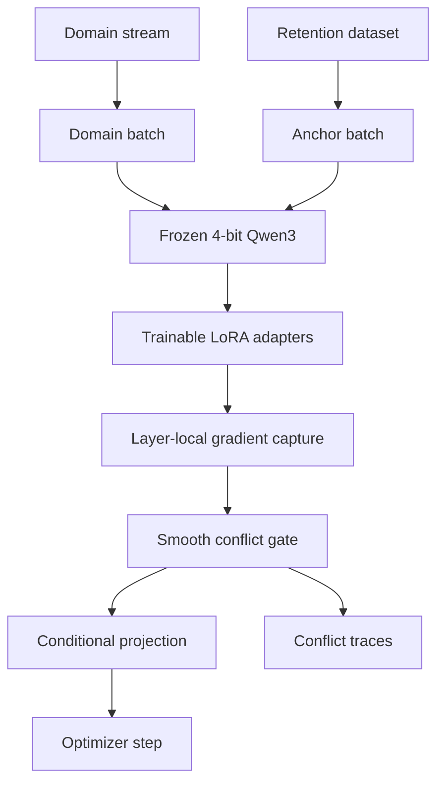
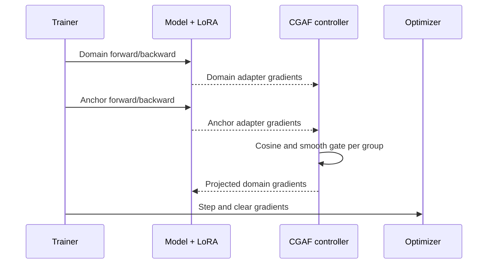
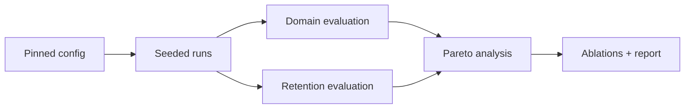

# CGAF-Tune Architecture

## System view

Only adapter gradients are modified; base-model weights remain frozen. Domain and anchor gradients are grouped by Transformer layer or target projection. A negative cosine activates a temperature-controlled gate that removes part of the anchor-opposing component.

## Training event sequence

## Experiment lifecycle

## Current implementation boundary

Implemented and tested (Phase 1):

- stable per-group cosine measurement;
- smooth gated projection without input mutation;
- numerical tests for aligned, conflicting, and grouped gradients;
- deterministic PEFT parameter grouping and gradient capture;
- two-pass CGAF optimizer-step engine with structured diagnostics;
- configuration validation, dry-run, and offline smoke-test entry points.

Next milestone (Phase 2):

- load JSONL/Hugging Face domain and anchor datasets;
- build the Qwen3 QLoRA model and tokenizer path;
- log conflict, gate activity, removed norm, memory, and time;
- run matched LoRA, rehearsal, hard-projection, and AdaLoRA controls.

This boundary is intentional: the repository does not represent the end-to-end LLM trainer as complete before integration and GPU validation.
