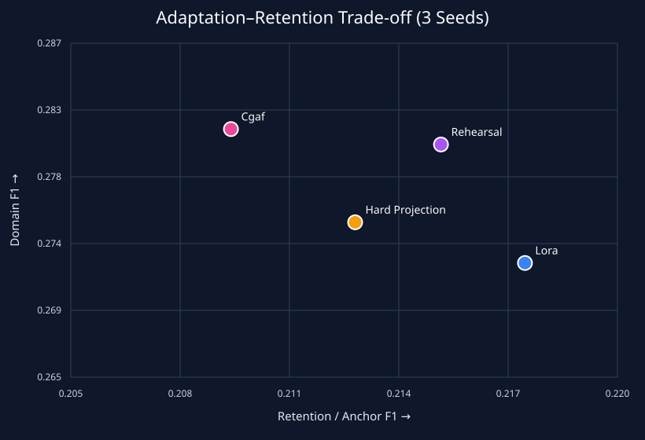
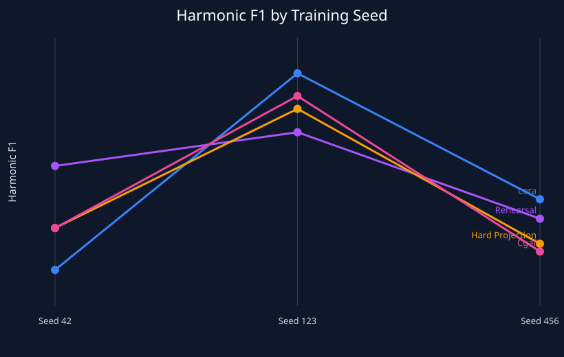

# Phase 7: statistical analysis and visual results

This phase analyses the leakage-controlled three-seed generation results from Phase 6. The analysis is reproducible with `scripts/analyze_phase7.py`.

## Aggregate results

| Method | Domain F1 | Anchor F1 | Harmonic F1 | Pareto |
|---|---:|---:|---:|:---:|
| Rehearsal | 0.2803 ± 0.0177 | 0.2152 ± 0.0074 | **0.2432 ± 0.0074** | Yes |
| LoRA | 0.2725 ± 0.0255 | **0.2175 ± 0.0120** | 0.2418 ± 0.0168 | Yes |
| CGAF | **0.2813 ± 0.0254** | 0.2094 ± 0.0096 | 0.2399 ± 0.0142 | Yes |
| Hard projection | 0.2752 ± 0.0264 | 0.2128 ± 0.0094 | 0.2396 ± 0.0125 | No |



The frontier shows three different operating points: LoRA maximizes retention, CGAF maximizes adaptation, and rehearsal has the highest mean balanced score. Hard projection is dominated by rehearsal, which has both higher mean domain and anchor F1.

## Seed sensitivity



Rankings change by seed. Rehearsal wins seed 42, LoRA wins seed 123 and seed 456, while CGAF ranks second at seed 123 but fourth at seed 456. This instability is central to the result and rules out strong claims from the mean alone.

## Paired differences versus LoRA

| Method | Δ Domain F1 | Δ Anchor F1 | Δ Harmonic F1 |
|---|---:|---:|---:|
| Rehearsal | +0.0078 | -0.0023 | +0.0014 |
| Hard projection | +0.0027 | -0.0047 | -0.0021 |
| CGAF | **+0.0088** | -0.0081 | -0.0019 |

All paired seed-bootstrap 95% intervals include zero. With only three seeds these intervals are descriptive and discrete, and the minimum attainable two-sided exact sign-test p-value is 0.25. Formal significance is therefore neither claimed nor implied.

## Research conclusion

CGAF consistently changes the trade-off in the intended direction—more domain adaptation—but the current gate is not strong enough to preserve retention. Its mean harmonic score is slightly below LoRA and rehearsal. The evidence supports a mechanism finding, not a state-of-the-art claim.

Phase 7 is complete. Phase 8 should publish the method, negative result, reproducibility package, limitations, and a concrete next hypothesis: strengthen or dynamically budget the retention constraint.

## Reproduce

```bash
python scripts/analyze_phase7.py \
  --input results/phase6-three-seed-summary.json \
  --output-dir outputs/phase7
```

The command emits `phase7-statistics.json`, `phase7-tradeoff.svg`, and `phase7-seed-sensitivity.svg`.
