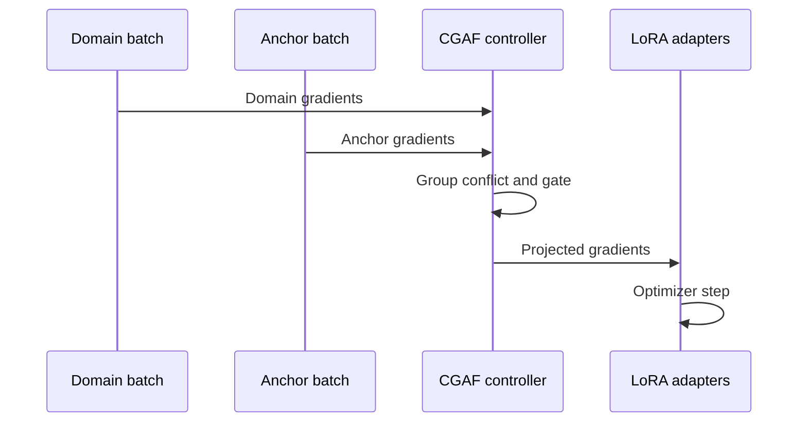

# Conflict-Gated Adaptive Fine-Tuning

## Abstract

Domain fine-tuning can improve a narrow capability while degrading instruction following, reasoning, factual recall, or multilingual behavior. CGAF is a parameter-efficient method that uses a small anchor stream to estimate which LoRA gradient components threaten retained capabilities. Instead of applying a fixed regularizer or hard global projection, CGAF measures conflict per adapter group and uses a smooth gate to remove only negatively aligned components. The project evaluates whether this local, conditional intervention improves the adaptation–retention Pareto frontier on Qwen3 under a single-GPU budget.

## Gap and hypothesis

LoRA makes adaptation economical but does not explicitly protect prior capabilities.^1 AdaLoRA allocates rank by importance but its objective is not capability retention.^2 Orthogonal Gradient Descent protects prior behavior by constraining update directions, while SketchOGD reduces the memory required to retain gradient information.^3,4 Empirical LLM studies show that continual instruction tuning can cause measurable forgetting.^5

These lines suggest a gap worth testing: **retention-aware projection directly in the low-rank adapter space, controlled continuously by current layer-local conflict**. Related techniques mean the ingredients are not individually new. The research contribution is their specific composition, its diagnostics, and a controlled demonstration of when it helps or fails.

Primary hypothesis: compared with matched LoRA, rehearsal, AdaLoRA, and hard projection, CGAF reduces retention loss without materially reducing domain gain.

## Method

For each domain mini-batch (B_D), sample a smaller anchor mini-batch (B_A). Compute gradients only for trainable adapter parameters. Parameters are grouped by Transformer layer or target module.

For group (l):

[
c_l = rac{langle g_l^D,g_l^A
angle}
{|g_l^D||g_l^A|+epsilon}
]

[
gamma_l =
egin{cases}
sigma(-c_l/T), & c_l < -delta \\
0, & 	ext{otherwise}
end{cases}
]

[
	ilde g_l^D =
g_l^D-gamma_l
rac{min(0,langle g_l^D,g_l^A
angle)}
{|g_l^A|^2+epsilon}g_l^A
]

The gate is close to one for strong conflict and zero for compatible gradients. Temperature (T) controls softness; (delta) filters numerical noise. Anchor gradients need not be applied as a second optimization objective: they define a local preservation direction.

## Falsification plan

The method should be rejected or narrowed if:

- gains disappear under equal wall-clock rather than equal-step budgets;
- simple rehearsal dominates it;
- benefits occur only for one dataset or seed;
- anchor choice determines results more than the gate;
- gradient conflict is not predictive of later forgetting;
- overhead prevents practical single-GPU use.

## Work packages

1. **Mechanism:** integrate two backward passes with gradient capture restricted to adapter parameters.
2. **Instrumentation:** log group cosine, gate, removed norm, depth, and task labels.
3. **Baselines:** implement budget-matched LoRA, rehearsal, hard projection, and AdaLoRA.
4. **Evaluation:** measure domain gain, retained capabilities, Pareto dominance, and systems cost.
5. **Analysis:** correlate early conflict with later forgetting and identify layers where intervention matters.
6. **Robustness:** test anchor mismatch, reduced anchor budgets, quantization, ranks, and projection intervals.

## Risks and mitigations

| Risk | Mitigation |
|---|---|
| Two backward passes are expensive | project every (k) steps; cache anchor gradients; restrict groups |
| Anchor set leaks evaluations | separate construction and evaluation sources; deduplicate |
| Gate only rescales learning | compare norm-matched random and cosine-independent gates |
| Results depend on metric aggregation | publish every component and Pareto plots |
| Qwen-specific effect | validate later on a second architecture |
| Novelty collision with new work | update the literature review before publication |

## Expected contribution

A successful result would contribute an adapter-space, conflict-aware optimizer; a reproducible retention evaluation protocol; and evidence explaining where specialization gradients collide with retained behavior. A negative result remains useful if it shows that conflict diagnostics do not predict forgetting or that rehearsal provides a superior frontier.

## Sources

1. Hu, E. et al. “[LoRA: Low-Rank Adaptation of Large Language Models](https://arxiv.org/abs/2106.09685).” 2021.
2. Zhang, Q. et al. “[AdaLoRA: Adaptive Budget Allocation for Parameter-Efficient Fine-Tuning](https://arxiv.org/abs/2303.10512).” 2023.
3. Farajtabar, M. et al. “[Orthogonal Gradient Descent for Continual Learning](https://arxiv.org/abs/1910.07104).” 2019.
4. Wright, B. et al. “[SketchOGD: Memory-Efficient Continual Learning](https://arxiv.org/abs/2305.16424).” 2023.
5. Luo, Y. et al. “[An Empirical Study of Catastrophic Forgetting in Large Language Models During Continual Fine-tuning](https://arxiv.org/abs/2308.08747).” 2023.
6. Yang, A. et al. “[Qwen3 Technical Report](https://arxiv.org/abs/2505.09388).” 2025.
7. Meng, F. et al. “[PiSSA](https://arxiv.org/abs/2404.02948).” 2024.
