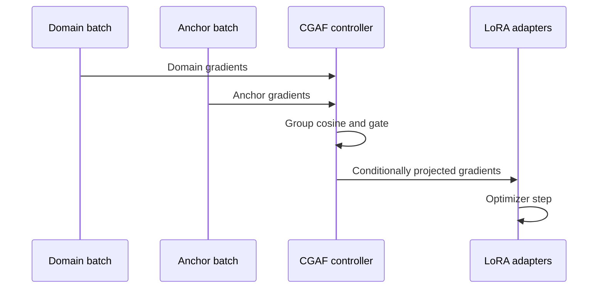

# Conflict-Gated Adaptive Fine-Tuning

## Abstract

Domain fine-tuning can improve a narrow capability while degrading instruction following, reasoning, factual recall, or multilingual behavior. CGAF uses a small anchor stream to estimate which LoRA gradient components threaten retained capabilities. Instead of applying a fixed regularizer or hard global projection, it measures conflict per adapter group and uses a smooth gate to remove only negatively aligned components. The project tests whether this local intervention improves the adaptation–retention Pareto frontier on Qwen3 under a single-GPU budget.

## Research gap

LoRA makes adaptation economical but does not explicitly protect prior capabilities.[1] QLoRA makes quantized single-GPU studies practical,[2] while AdaLoRA allocates rank according to importance rather than capability retention.[3] LoRA+ changes optimization rates,[4] and LoRA-GA uses gradient information for initialization.[5]

Recent work narrows the defensible novelty claim. Continual low-rank projection, gradient-surgery initialization, and analyses of task-gradient subspace geometry now directly connect LoRA with interference and forgetting.[6–8] The ingredients are not individually new. CGAF's testable contribution is the specific use of **online, layer-local, smoothly gated projection in adapter space**, with matched-budget controls and diagnostics designed to reveal when the gate helps or fails.

## Method

For every domain mini-batch \(B_D\), sample a smaller capability-retention anchor batch \(B_A\). Compute gradients only for trainable adapter parameters and group them by Transformer layer or target module.

For group \(l\), cosine alignment is

\[
c_l = \frac{\langle g_l^D,g_l^A\rangle}
{\lVert g_l^D\rVert\lVert g_l^A\rVert+\epsilon}.
\]

The conflict gate and modified domain gradient are

\[
\gamma_l =
\begin{cases}
\sigma(-c_l/T), & c_l < -\delta,\\
0, & \text{otherwise},
\end{cases}
\qquad
\widetilde g_l^D = g_l^D - \gamma_l
\frac{\min(0,\langle g_l^D,g_l^A\rangle)}
{\lVert g_l^A\rVert^2+\epsilon}g_l^A.
\]

Compatible gradients are untouched. Temperature \(T\) controls softness and \(\delta\) filters numerical noise. Anchor gradients define a local preservation direction; they need not be added as a second optimization objective.

## Falsifiable hypotheses

- **H1:** At equal data, steps, and trainable parameters, CGAF reduces capability loss relative to plain LoRA.
- **H2:** Smooth local gating yields a better adaptation–retention frontier than rehearsal and hard projection.
- **H3:** Early per-layer conflict predicts later forgetting better than gradient magnitude alone.
- **H4:** Periodic projection retains most of the benefit while lowering two-backward-pass overhead.

## Experimental design

The initial study targets Qwen3-0.6B for rapid mechanism validation, then Qwen3-1.7B for confirmation. Every arm uses identical examples, update counts, adapter targets, and rank. Controls are plain LoRA/QLoRA, rehearsal LoRA, hard PCGrad-style projection, and AdaLoRA. At least three seeds are required.

Primary outcomes are domain gain, retained-capability score, forgetting, harmonic adaptation–retention score, peak memory, and wall-clock overhead. Report raw runs, mean and standard deviation, paired bootstrap 95% confidence intervals, and effect sizes. Treat anchor construction and task order as experimental factors.

## Ablations

1. global versus layer-wise versus module-wise gates;
2. gate temperature and conflict threshold;
3. anchor size and composition;
4. projection frequency and cached anchor gradients;
5. smooth gate versus hard projection;
6. norm-matched random and cosine-independent gates;
7. LoRA rank and 4-bit versus higher-precision base weights.

## Failure criteria

Reject or narrow the hypothesis if gains disappear under equal wall-clock budgets, rehearsal dominates, results occur only for one dataset or seed, anchor choice explains more variance than gating, conflict does not predict forgetting, or overhead prevents practical use.

## Risks and mitigations

| Risk | Mitigation |
|---|---|
| Two backward passes are expensive | Project every \(k\) steps and test cached anchor gradients |
| Anchor data leaks evaluation content | Separate sources and deduplicate before training |
| Gate only changes effective learning rate | Add norm-matched and cosine-independent controls |
| Aggregation hides regressions | Publish component metrics and Pareto plots |
| Architecture-specific effect | Confirm on a second model family after the core study |
| Concurrent novelty collision | Maintain a dated literature matrix before submission |

## Expected contribution

If supported, the work contributes a conflict-aware adapter optimizer, a reproducible retention protocol, and evidence about where specialization gradients collide with retained behavior. A negative result remains valuable if local conflict diagnostics fail to predict forgetting or rehearsal provides a better frontier.

## Sources

1. Hu et al. “[LoRA: Low-Rank Adaptation of Large Language Models](https://arxiv.org/abs/2106.09685).” 2021.
2. Dettmers et al. “[QLoRA: Efficient Finetuning of Quantized LLMs](https://arxiv.org/abs/2305.14314).” 2023.
3. Zhang et al. “[AdaLoRA: Adaptive Budget Allocation for Parameter-Efficient Fine-Tuning](https://openreview.net/forum?id=lq62uWRJjiY).” ICLR 2023.
4. Hayou et al. “[LoRA+: Efficient Low Rank Adaptation of Large Models](https://arxiv.org/abs/2402.12354).” 2024.
5. Wang et al. “[LoRA-GA: Low-Rank Adaptation with Gradient Approximation](https://arxiv.org/abs/2407.05000).” 2024.
6. Wang et al. “[Continual Gradient Low-Rank Projection Fine-Tuning for LLMs](https://arxiv.org/abs/2507.02503).” 2025.
7. Pasquali et al. “[Low-Rank Adapters Initialization via Gradient Surgery for Continual Learning](https://arxiv.org/abs/2605.12752).” 2026 preprint.
8. Steele. “[Subspace Geometry Governs Catastrophic Forgetting in Low-Rank Adaptation](https://arxiv.org/abs/2603.02224).” 2026 preprint.
9. Yang et al. “[Qwen3 Technical Report](https://arxiv.org/abs/2505.09388).” 2025.
